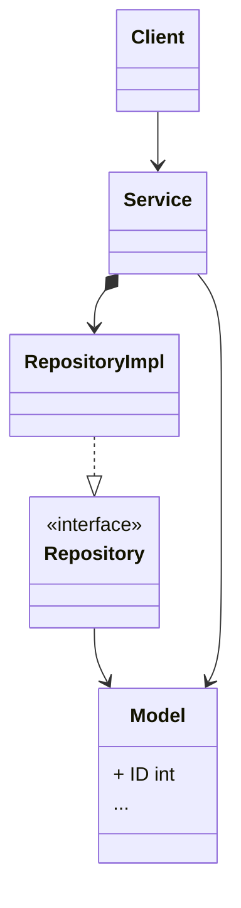

The Repository pattern is based on the idea that data access code should be separated from business logic code. Repository Pattern provides a way to manage data access code in a centralised location, thus reducing code duplication and improving code maintainability.

The basic structure of a code following the pattern can be summarised as:
1. **Model Layer**: Define struct(s) for the data model.
2. **Repository Layer**: Interface to abstract database interaction.
3. **Service Layer**: Business logic using the repository interface.
4. **UI Layer**: A CLI or REST for user interaction.



## Define a Data Model
```go
type User struct {
	ID    int    `json:"id,omitempty gorm:"primaryKey;autoIncrement`
	Name  string `json:"name,omitempty"`
	Email string `json:"email,omitempty"`
}
```
## Define a Repository Interface
```go
type UserRepository interface {
	Create(user *User) error
	Read(id int) (*User, error)
	Update(user *User) error
	Delete(id int) error
	List() ([]User, error)
}
```
## Implement the Repository
```go
type UserRepositoryImpl struct {
    db *gorm.DB
}

func NewUserRepository(db *gorm.DB) *UserRepository {
    return &UserRepositoryImpl{db: db}
}

func (r *UserRepositoryImpl) Create(user *User) error {
    return r.db.Create(user).Error
}

func (r *UserRepositoryImpl) Read(id int) (*User, error) {
    var user User
    if err := r.db.First(&user, id).Error; err != nil {
        return nil, err
    }
    return &user, nil
}

func (r *UserRepositoryImpl) Update(user *User) error {
    return r.db.Save(user).Error
}

func (r *UserRepositoryImpl) Delete(id int) error {
    return r.db.Delete(&User{}, id).Error
}

func (r *UserRepositoryImpl) List() ([]User, error) {
    var users []User
    if err := r.db.Find(&users).Error; err != nil {
        return nil, err
    }
    return users, nil
}
```
## Define a Service Layer
The service layer will contain the business logic and interact with the repository. Define a `UserService` interface and a concrete implementation.
```go
type UserService interface {
    CreateUser(name, email string) (*User, error)
    GetUser(id int) (*User, error)
    UpdateUser(id int, name, email string) error
    DeleteUser(id int) error
    ListUsers() ([]User, error)
}

type UserServiceImpl struct {
    repo UserRepository
}

func NewUserService(repo UserRepository) UserService {
    return &UserServiceImpl{repo: repo}
}

func (s *UserServiceImpl) CreateUser(name, email string) (*User, error) {
    user := &User{Name: name, Email: email}
    if err := s.repo.Create(user); err != nil {
        return nil, err
    }
    return user, nil
}

func (s *UserServiceImpl) GetUser(id int) (*User, error) {
    return s.repo.Read(id)
}

func (s *UserServiceImpl) UpdateUser(id int, name, email string) error {
    user, err := s.repo.Read(id)
    if err != nil {
        return err
    }
    user.Name = name
    user.Email = email
    return s.repo.Update(user)
}

func (s *UserServiceImpl) DeleteUser(id int) error {
    return s.repo.Delete(id)
}

func (s *UserServiceImpl) ListUsers() ([]User, error) {
    return s.repo.List()
}
```
## Create a CLI or HTTP Interface
To interact with the user, you can create either a Command-Line Interface (CLI) or a REST API. Here’s an example of a simple CLI using `fmt.Scan` and `fmt.Println`.
